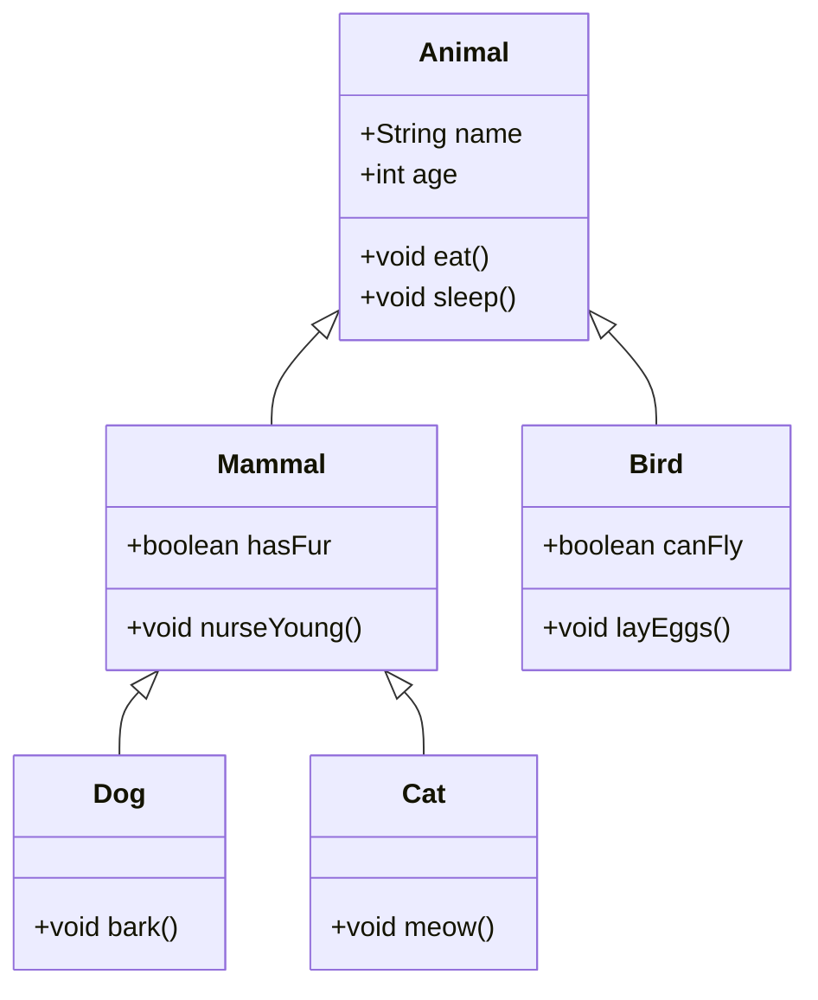

# Class Diagram

```mermaid
classDiagram
    class Animal {
      +String name
      +int age
      +void eat()
      +void sleep()
    }
    class Mammal {
      +boolean hasFur
      +void nurseYoung()
    }
    class Bird {
      +boolean canFly
      +void layEggs()
    }
    Animal <|-- Mammal
    Animal <|-- Bird
    class Dog {
      +void bark()
    }
    class Cat {
      +void meow()
    }
    Mammal <|-- Dog
    Mammal <|-- Cat
```