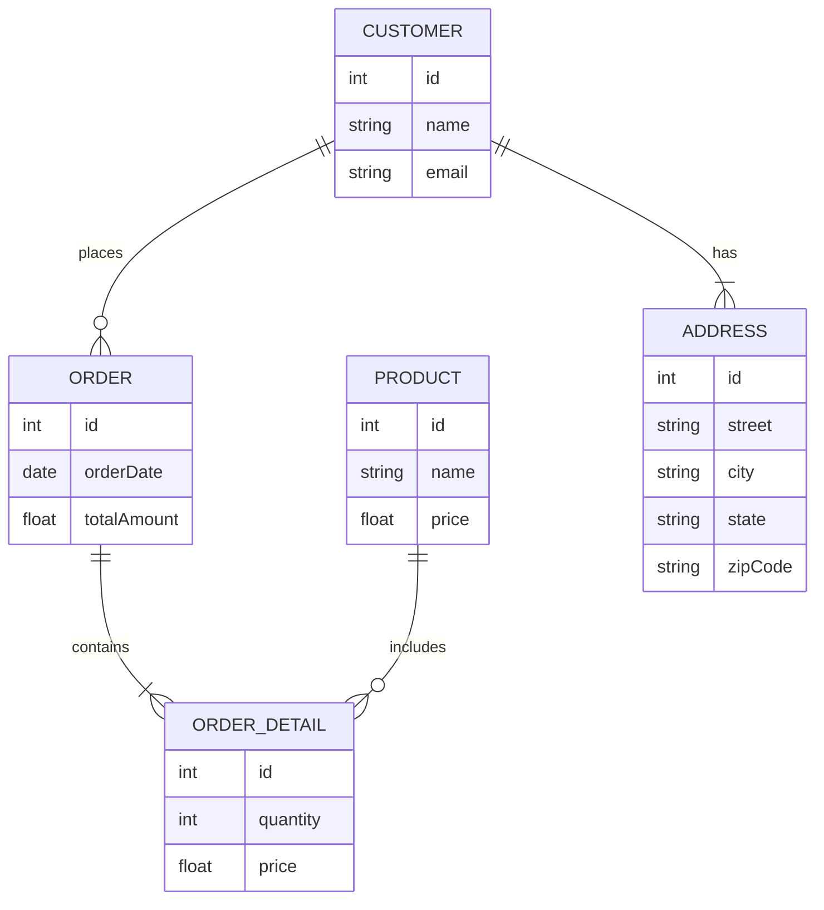

# Entity Relationship Diagram

```mermaid
erDiagram
    CUSTOMER {
        int id
        string name
        string email
    }
    ORDER {
        int id
        date orderDate
        float totalAmount
    }
    PRODUCT {
        int id
        string name
        float price
    }
    ORDER_DETAIL {
        int id
        int quantity
        float price
    }
    ADDRESS {
        int id
        string street
        string city
        string state
        string zipCode
    }
    CUSTOMER ||--o{ ORDER : places
    ORDER ||--|{ ORDER_DETAIL : contains
    PRODUCT ||--o{ ORDER_DETAIL : includes
    CUSTOMER ||--|{ ADDRESS : has
```