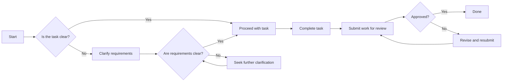

# Flowchart

```mermaid
flowchart LR
    A[Start] --> B{Is the task clear?}
    B -- Yes --> C[Proceed with task]
    B -- No --> D[Clarify requirements]
    D --> E{Are requirements clear?}
    E -- Yes --> C
    E -- No --> F[Seek further clarification]
    F --> E
    C --> G[Complete task]
    G --> H[Submit work for review]
    H --> I{Approved?}
    I -- Yes --> J[Done]
    I -- No --> K[Revise and resubmit]
    K --> H
```