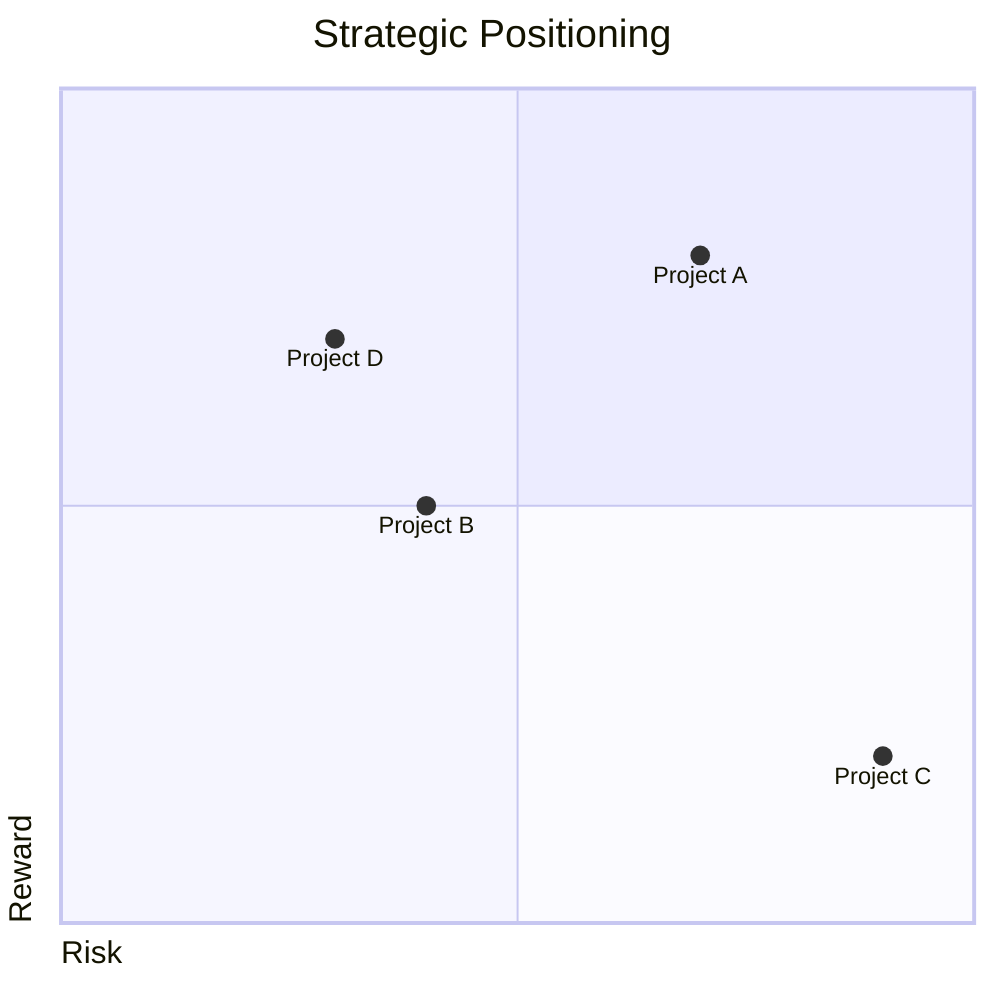

# Quadrant Chart

```mermaid
quadrantChart
    title Strategic Positioning
    x-axis Risk
    y-axis Reward
    "Project A" : [0.7, 0.8]
    "Project B" : [0.4, 0.5]
    "Project C" : [0.9, 0.2]
    "Project D" : [0.3, 0.7]
```