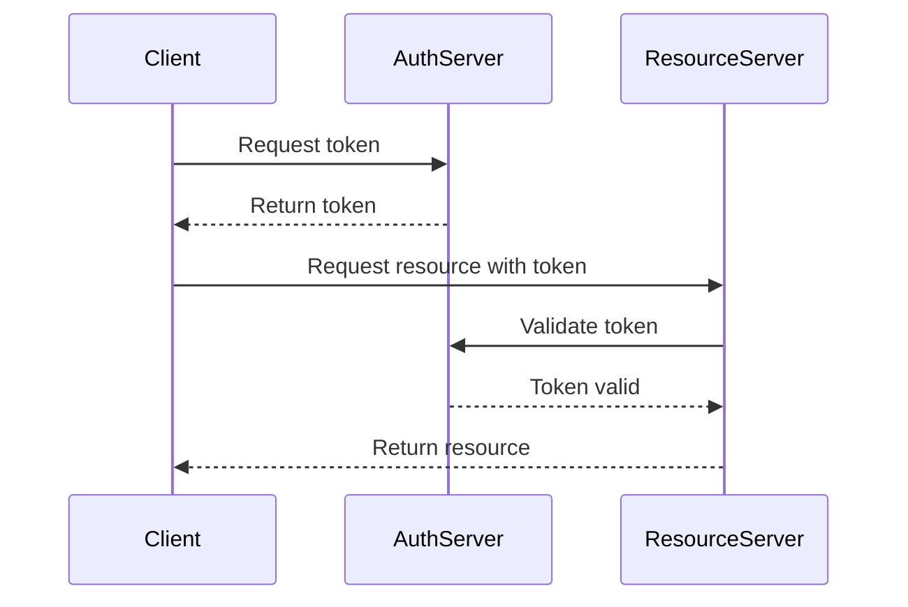

# Sequence Diagram

```mermaid
sequenceDiagram
    participant Client
    participant AuthServer
    participant ResourceServer
    Client->>AuthServer: Request token
    AuthServer-->>Client: Return token
    Client->>ResourceServer: Request resource with token
    ResourceServer->>AuthServer: Validate token
    AuthServer-->>ResourceServer: Token valid
    ResourceServer-->>Client: Return resource
```