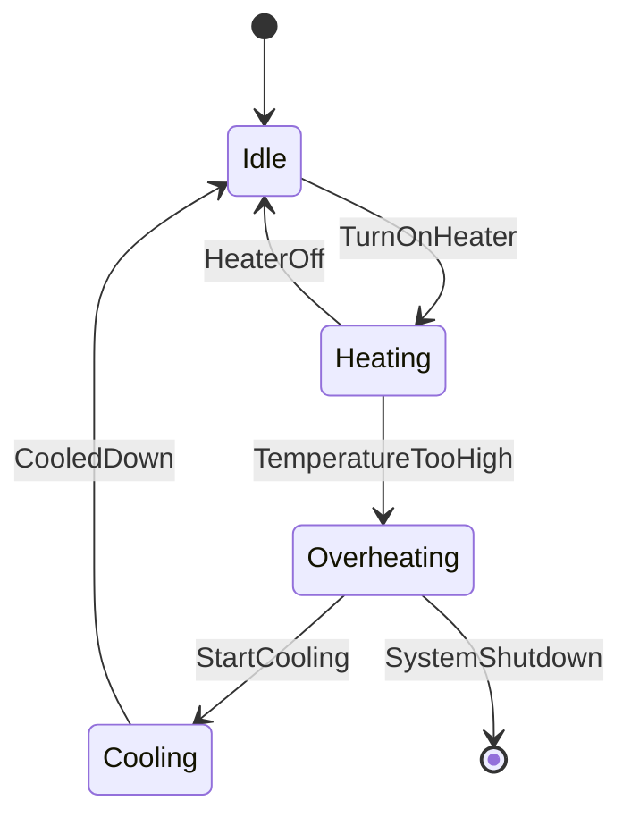

# State Diagram

```mermaid
stateDiagram-v2
    [*] --> Idle
    Idle --> Heating : TurnOnHeater
    Heating --> Idle : HeaterOff
    Heating --> Overheating : TemperatureTooHigh
    Overheating --> Cooling : StartCooling
    Cooling --> Idle : CooledDown
    Overheating --> [*] : SystemShutdown
```